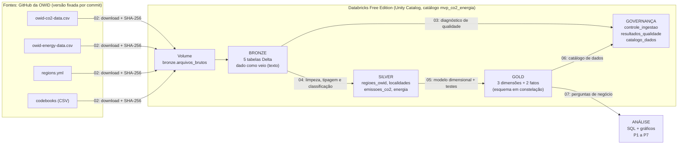
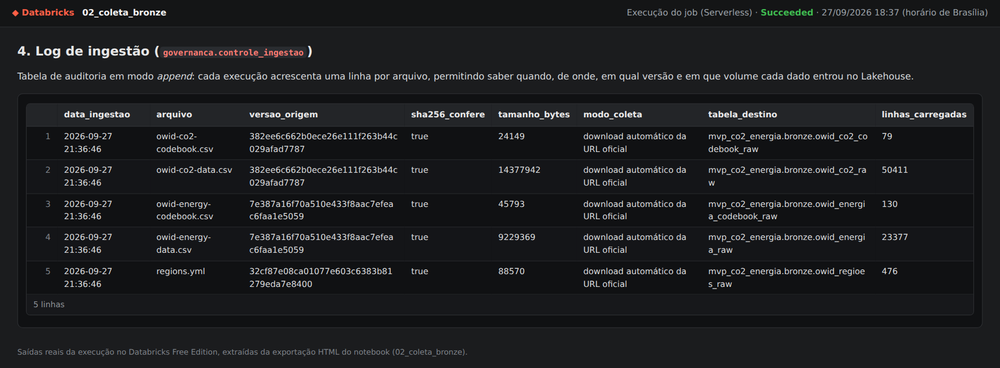
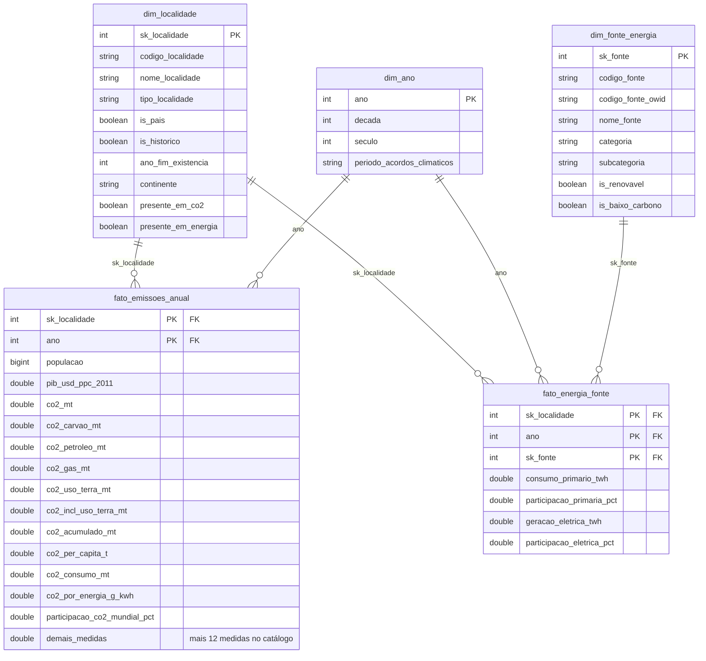
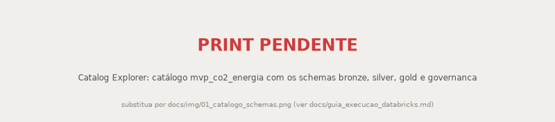
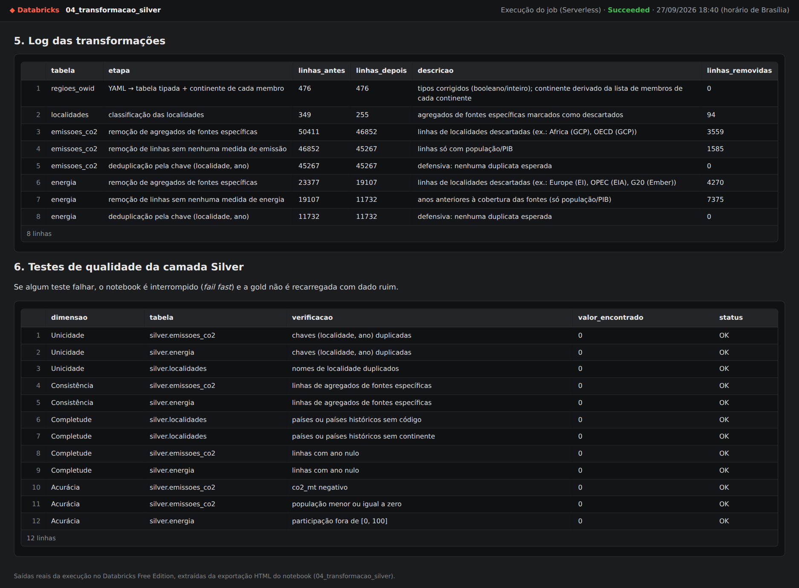
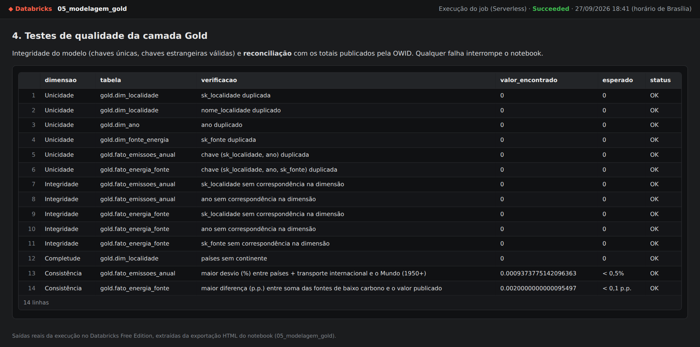
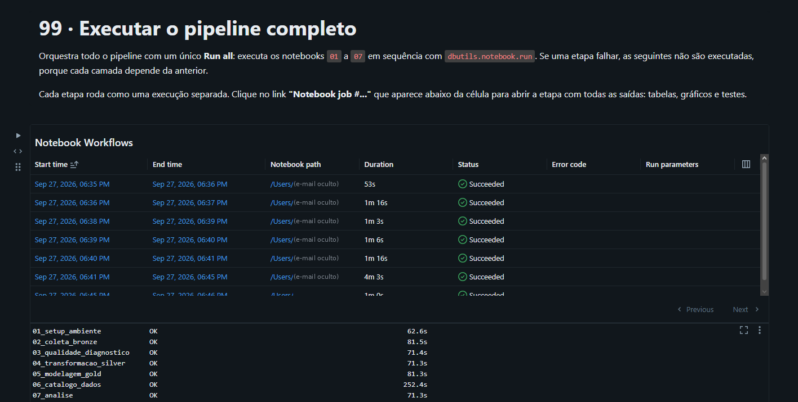
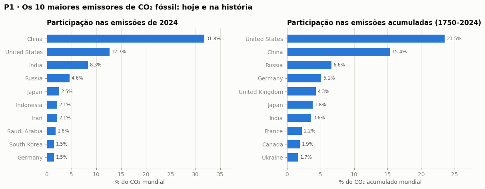
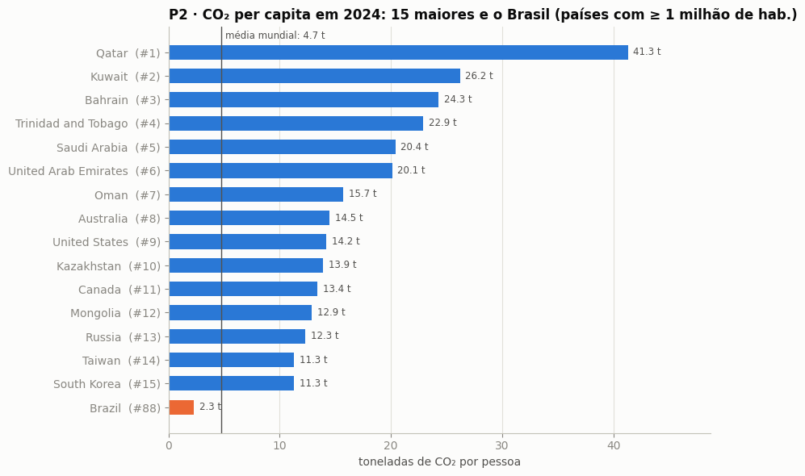
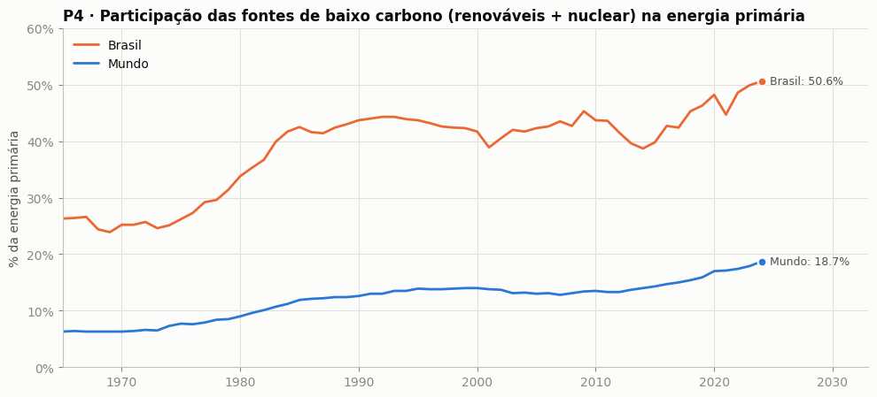

# MVP de Engenharia de Dados: emissões de CO₂ e transição energética

**PUC-Rio, Pós-graduação: MVP de Engenharia de Dados**<br>
**Aluno:** Gianluca Scofano<br>
**Data:** setembro de 2026<br>
**Plataforma:** Databricks Free Edition (Unity Catalog + Delta Lake + computação serverless)<br>
**Fonte dos dados:** [Our World in Data](https://ourworldindata.org/) (CO₂, energia e definição de regiões), licença CC BY 4.0

Pipeline de dados em nuvem, de ponta a ponta, na **arquitetura medalhão** (Bronze → Silver → Gold). Ele coleta três arquivos
públicos da Our World in Data, trata os problemas de qualidade encontrados e organiza os dados em um **modelo dimensional
documentado no Unity Catalog**. Com esse modelo, o MVP responde a 7 perguntas sobre quem emite CO₂, se é possível crescer emitindo
menos e qual é a posição do Brasil na transição energética.

> **Principais resultados:**
>
> - China, EUA e Índia emitem **52,8%** do CO₂ fóssil mundial.
> - **7 dos 20 maiores emissores** cresceram o PIB reduzindo as emissões entre 2000 e 2022.
> - O Brasil tem **50,6%** de energia de baixo carbono (7º de 79 países), mas é o **5º maior emissor do mundo** quando o
>   desmatamento entra na conta: ele responde por **77%** do CO₂ brasileiro.

**Evidências de execução:** o pipeline completo rodou no Databricks Free Edition em 27/09/2026, com as 7 etapas concluídas pelo
notebook `99` ([print](#4-pipeline-de-dados-etapa-44)). As demais imagens de evidência deste README mostram as saídas reais das
células, extraídas das exportações HTML dos notebooks executados na plataforma. Os arquivos exportados estão em
[`docs/evidencias/`](docs/evidencias/) e abrem em qualquer navegador (baixe o `.html` e abra localmente).

---

## Sumário

- [Arquitetura e organização do projeto](#arquitetura-e-organização-do-projeto)
- [1. Contexto de Negócio e Perguntas (Etapa 2 e 4.1)](#1-contexto-de-negócio-e-perguntas-etapa-2-e-41)
- [2. Carga dos Dados (Etapa 4.2)](#2-carga-dos-dados-etapa-42)
- [3. Modelagem e Catálogo de Dados (Etapa 4.3)](#3-modelagem-e-catálogo-de-dados-etapa-43)
- [4. Pipeline de Dados (Etapa 4.4)](#4-pipeline-de-dados-etapa-44)
- [5. Qualidade de Dados (Etapa 4.5)](#5-qualidade-de-dados-etapa-45)
- [6. Análise de Dados (Etapa 4.5)](#6-análise-de-dados-etapa-45)
- [7. Autoavaliação](#7-autoavaliação)
- [Como reproduzir no Databricks](#como-reproduzir-no-databricks)
- [Referências](#referências)

---

## Arquitetura e organização do projeto



| Notebook | Etapa | O que faz |
|---|---|---|
| [`00_configuracao`](notebooks/00_configuracao.py) | Configuração | Parâmetros compartilhados: catálogo, schemas, Volume, URLs fixadas das fontes e hashes esperados |
| [`01_setup_ambiente`](notebooks/01_setup_ambiente.py) | Estrutura | Cria o catálogo, os schemas `bronze`, `silver`, `gold` e `governanca` e o Volume de pouso |
| [`02_coleta_bronze`](notebooks/02_coleta_bronze.py) | Coleta (4.2) | Baixa os arquivos para o Volume, confere o SHA-256, grava as tabelas bronze e o log de ingestão |
| [`03_qualidade_diagnostico`](notebooks/03_qualidade_diagnostico.py) | Qualidade (4.5) | Diagnóstico por atributo: completude, consistência, unicidade, acurácia e outliers |
| [`04_transformacao_silver`](notebooks/04_transformacao_silver.py) | ETL (4.4) | Limpeza, tipagem, padronização, classificação de localidades, testes da silver |
| [`05_modelagem_gold`](notebooks/05_modelagem_gold.py) | Modelagem (4.3) | Dimensões e fatos, chaves (PK/FK), restrições CHECK, testes de integridade e reconciliação |
| [`06_catalogo_dados`](notebooks/06_catalogo_dados.py) | Catálogo (4.3) | Comentários de tabela e coluna no Unity Catalog, com domínio e linhagem; tabela `governanca.catalogo_dados` |
| [`07_analise`](notebooks/07_analise.py) | Análise (4.5) | Consultas SQL sobre a gold, gráficos e discussão das perguntas P1 a P7 |
| [`99_executar_pipeline_completo`](notebooks/99_executar_pipeline_completo.py) | Orquestração (4.4) | Executa os notebooks 01 a 07 em sequência com um único *Run all* e mostra o status e a duração de cada etapa |

Os notebooks estão no formato de código-fonte do Databricks (`.py`) e rodam direto de uma **Git folder** conectada a este repositório.

---

## 1. Contexto de Negócio e Perguntas (Etapa 2 e 4.1)

### 1.1 Problema

As mudanças climáticas são causadas principalmente pelo acúmulo de CO₂ na atmosfera. As decisões sobre como enfrentá-las (quem
deve reduzir, quanto e como) dependem de responder com dados a perguntas que parecem simples, mas cuja resposta muda conforme a
métrica escolhida:

- quem emite mais: o país que emite mais hoje ou o que mais emitiu na história?
- o total do país ou a emissão por pessoa?
- é possível crescer economicamente sem aumentar as emissões?

O Brasil é um caso particular nessa discussão. O país é conhecido pela matriz energética limpa, mas também pelo desmatamento.

**Problema:** *entender quem é responsável pelas emissões de CO₂, se o crescimento econômico ainda exige emitir mais e se a transição
para fontes de baixo carbono está de fato reduzindo o carbono da energia, com atenção especial à posição do Brasil.*

O público-alvo é uma equipe de análise ESG/sustentabilidade que precisa de uma base **confiável, consolidada e documentada**
para comparar países. É um trabalho típico de engenharia de dados: as fontes existem, mas misturam países com agregados,
chegam em formatos diferentes e não conversam entre si.

### 1.2 Perguntas de negócio

| # | Pergunta |
|---|---|
| **P1** | Quais países mais emitem CO₂ hoje e quais mais emitiram ao longo da história? Quão concentradas são as emissões? |
| **P2** | O ranking muda quando consideramos o tamanho da população? Onde o Brasil se posiciona? |
| **P3** | É possível crescer sem emitir mais? Quais países aumentaram o PIB e reduziram as emissões entre 2000 e 2022? |
| **P4** | A transição energética está acontecendo? Como evoluiu a participação das fontes de baixo carbono na energia do mundo e do Brasil? |
| **P5** | Países com mais energia de baixo carbono têm, de fato, energia menos intensiva em carbono? |
| **P6** | Qual é o peso do desmatamento (mudança no uso da terra) nas emissões do Brasil, comparado a outros grandes emissores? |
| **P7** | Como a distribuição geográfica das emissões mudou entre 1950, 1990 e 2024? |

### 1.3 Busca pelos dados: por que a Our World in Data

A [Our World in Data (OWID)](https://ourworldindata.org/co2-and-greenhouse-gas-emissions) consolida as principais fontes científicas
sobre o tema: Global Carbon Project, Energy Institute *Statistical Review of World Energy*, U.S. EIA, Ember e Maddison Project.
Ela as publica com país e ano harmonizados. As bases escolhidas atendem diretamente às perguntas:

| Fonte | Arquivo | Conteúdo | Perguntas |
|---|---|---|---|
| [owid/co2-data](https://github.com/owid/co2-data) | `owid-co2-data.csv` | Emissões de CO₂ (por origem, per capita, acumuladas, por consumo, uso da terra), outros gases, população e PIB | P1, P2, P3, P5, P6, P7 |
| [owid/energy-data](https://github.com/owid/energy-data) | `owid-energy-data.csv` | Consumo de energia primária e geração de eletricidade por fonte | P4, P5 |
| [owid/etl (regions)](https://github.com/owid/etl/blob/master/etl/steps/data/garden/regions/2023-01-01/regions.yml) | `regions.yml` | Definição oficial de regiões: códigos, países históricos, composição dos continentes | P7 (e a classificação das localidades) |
| owid/co2-data e owid/energy-data | `owid-*-codebook.csv` | Dicionários oficiais das colunas (descrição, unidade, fonte) | catálogo de dados |

**Versão fixada.** A OWID atualiza os arquivos periodicamente. Por isso, as URLs usadas apontam para um **commit específico** de
cada repositório (`co2-data@382ee6c`, `energy-data@7e387a1`, `etl@32cf87e`), e o pipeline confere o **hash SHA-256** de cada
arquivo. Qualquer execução reproduz exatamente os números deste documento.

### 1.4 Estrutura dos dados brutos

| Arquivo | Linhas | Colunas | Granularidade | Cobertura |
|---|---:|---:|---|---|
| `owid-co2-data.csv` | 50.411 | 79 | localidade × ano | 1750–2024, 254 localidades |
| `owid-energy-data.csv` | 23.377 | 130 | localidade × ano | 1900–2025, 314 localidades |
| `regions.yml` | 476 regiões | 11 campos | região | países, países históricos, continentes e agregados |
| `owid-co2-codebook.csv` / `owid-energy-codebook.csv` | 79 / 130 | 5 | coluna do dataset | descrição, unidade e fonte de cada coluna |

Principais colunas usadas:

- **CO₂:**
  - chaves: `country`, `year`, `iso_code`;
  - contexto: `population`, `gdp`;
  - emissões por origem: `co2`, `coal_co2`, `oil_co2`, `gas_co2`, `cement_co2`, `flaring_co2`, `other_industry_co2`;
  - uso da terra: `land_use_change_co2`, `co2_including_luc`;
  - acumulado e por pessoa: `cumulative_co2`, `co2_per_capita`;
  - consumo e comércio: `consumption_co2`, `trade_co2`;
  - intensidade: `co2_per_unit_energy`;
  - participação mundial: `share_global_co2`;
  - outros gases: `total_ghg`, `methane`, `nitrous_oxide`.
- **Energia:** para 9 fontes (carvão, petróleo, gás, nuclear, hídrica, solar, eólica, biocombustíveis, outras renováveis) há
  quatro colunas por fonte:
  - `<fonte>_consumption`: consumo de energia primária em TWh;
  - `<fonte>_share_energy`: participação na energia primária, em %;
  - `<fonte>_electricity`: geração de eletricidade em TWh;
  - `<fonte>_share_elec`: participação na eletricidade, em %.

  Além delas, há os totais (`primary_energy_consumption`, `electricity_generation`, `low_carbon_share_energy`...).
- **Regiões:** `code`, `name`, `region_type`, `is_historical`, `end_year`, `members`, `aliases`.

A descrição completa de cada coluna de origem está nos codebooks, carregados como tabelas bronze.

### 1.5 Licença

- **Dados produzidos pela OWID:** licença [**Creative Commons BY 4.0**](https://creativecommons.org/licenses/by/4.0/), que permite
  usar, distribuir e reproduzir em qualquer meio, desde que a fonte e os autores sejam citados.
- **Dados de terceiros** redistribuídos pela OWID (Global Carbon Project, Energy Institute, EIA, Ember, Maddison Project) seguem os
  termos das fontes originais, citadas no codebook. Todas permitem uso acadêmico com atribuição.
- **Uso neste MVP:** acadêmico e não comercial, com a atribuição feita nesta seção e nas [Referências](#referências).
- **Dados pessoais:** os dados são agregados por país e não contêm informação pessoal.

---

## 2. Carga dos Dados (Etapa 4.2)

**Script:** [`notebooks/02_coleta_bronze.py`](notebooks/02_coleta_bronze.py) (usa as URLs de [`00_configuracao`](notebooks/00_configuracao.py)).

Os dados vão da origem até a nuvem em quatro passos:

1. **Área de pouso.** O notebook `01` cria no Unity Catalog o Volume `mvp_co2_energia.bronze.arquivos_brutos`, onde os arquivos
   ficam guardados exatamente como vieram.
2. **Coleta.** Para cada um dos 5 arquivos, o notebook `02` verifica se o arquivo já está no Volume. Se não estiver, baixa da URL
   oficial (fixada em um commit) e copia para lá. Se o ambiente não tiver acesso à internet, basta fazer o upload manual dos
   arquivos pela interface do Volume (*Upload to this volume*) e reexecutar: o notebook reaproveita o que já está no Volume.
3. **Integridade.** O hash SHA-256 de cada arquivo é calculado e comparado com o hash esperado da versão fixada.
4. **Carga bronze.** Cada arquivo vira uma **tabela Delta** no schema `bronze`:
   - os CSVs são lidos com `inferSchema = false`, então **toda coluna entra como texto** e nenhum valor é reinterpretado na entrada;
   - o YAML de regiões é convertido em tabela sem interpretar os valores (listas viram `ARRAY<STRING>`);
   - toda tabela recebe as colunas de controle `_arquivo_origem`, `_url_origem`, `_versao_origem` (commit) e `_data_ingestao`.

Cada execução também grava uma linha por arquivo na tabela de auditoria `governanca.controle_ingestao`, com arquivo, URL, commit,
SHA-256, tamanho, modo de coleta, tabela de destino e linhas carregadas.

| Tabela bronze | Origem | Linhas |
|---|---|---:|
| `bronze.owid_co2_raw` | `owid-co2-data.csv` | 50.411 |
| `bronze.owid_energia_raw` | `owid-energy-data.csv` | 23.377 |
| `bronze.owid_regioes_raw` | `regions.yml` | 476 |
| `bronze.owid_co2_codebook_raw` | `owid-co2-codebook.csv` | 79 |
| `bronze.owid_energia_codebook_raw` | `owid-energy-codebook.csv` | 130 |

**Evidências:**


*Notebook 02 no Databricks: os 5 arquivos baixados das URLs oficiais para o Volume `bronze.arquivos_brutos`, com o SHA-256
conferido contra a versão fixada.*


*Notebook 02: tabela `governanca.controle_ingestao`, com versão de origem, SHA-256 conferido e linhas carregadas em cada tabela
bronze (`data_ingestao` em UTC).*

---

## 3. Modelagem e Catálogo de Dados (Etapa 4.3)

### 3.1 Modelo escolhido: esquema em constelação (star schema com fatos compartilhando dimensões)

As perguntas cruzam duas coisas medidas em granularidades diferentes:

- **emissões**, medidas por país e ano;
- **energia**, medida por país, ano e fonte.

Por isso a gold tem **duas tabelas fato que compartilham dimensões conformadas** (localidade e ano). Esse arranjo, chamado de
*galaxy schema*, permite a consulta *drill-across* da pergunta P5, que cruza as duas fatos pelo mesmo país e ano.



| Tabela | Tipo | Granularidade | Linhas | Decisões de modelagem |
|---|---|---|---:|---|
| `gold.dim_localidade` | Dimensão | uma localidade | 255 | Mantém países **e** agregados úteis (Mundo, continentes, grupos de renda, UE, transporte internacional), com `tipo_localidade` e a flag `is_pais`. Somas e rankings filtram `is_pais = true`. Continente vindo do `regions.yml`. Chave substituta determinística |
| `gold.dim_ano` | Dimensão | um ano | 276 | Década, século e período em relação a Kyoto (1997) e Paris (2015) |
| `gold.dim_fonte_energia` | Dimensão | uma fonte | 9 | Classificação da OWID: baixo carbono = renováveis + nuclear. Evita somar colunas "na mão" |
| `gold.fato_emissoes_anual` | Fato | localidade × ano | 45.267 | 25 medidas com a unidade no nome (`_mt`, `_t`, `_pct`, `_g_kwh`) |
| `gold.fato_energia_fonte` | Fato | localidade × ano × fonte | 78.154 | 36 colunas da silver viraram linhas (`stack`), uma por fonte. A geração elétrica só é carregada quando a abertura por fonte fecha com o total |

As **chaves primárias e estrangeiras** são declaradas no Unity Catalog (`PRIMARY KEY` / `FOREIGN KEY`), e as colunas de chave são
`NOT NULL`. Regras de domínio viram **`CHECK` constraints** do Delta: participações entre 0 e 100, CO₂ não negativo, população
positiva e ano válido. Assim, cargas futuras fora do domínio são bloqueadas.

### 3.2 Catálogo de dados

O catálogo é registrado **no próprio Unity Catalog**, como comentário de cada tabela e de cada coluna, pelo notebook
[`06_catalogo_dados`](notebooks/06_catalogo_dados.py). Cada comentário de coluna traz os quatro itens pedidos:

- **descrição**, com a unidade de medida;
- **tipo** (vem do schema);
- **domínio de valores**, **calculado a partir dos dados** (mínimo–máximo para números; lista de categorias para campos categóricos),
  para nunca ficar desatualizado;
- **origem/linhagem**: tabela e coluna de onde o campo veio e qual transformação o gerou.

A linhagem entre tabelas também é registrada automaticamente pelo Unity Catalog (aba *Lineage*). Tudo é consolidado na tabela
consultável `governanca.catalogo_dados`, com **177 colunas documentadas e nenhuma sem documentação**.

O catálogo completo (silver, gold e governança) está transcrito em [`docs/catalogo_dados.md`](docs/catalogo_dados.md).

Resumo do catálogo da camada gold:

<details>
<summary><b>gold.dim_localidade</b>: localidades (países, países históricos, continentes, Mundo...)</summary>

| Coluna | Tipo | Descrição | Domínio | Origem |
|---|---|---|---|---|
| `sk_localidade` | int | Chave substituta (PK) | 1 a 255 | `row_number()` sobre `silver.localidades.nome_localidade` |
| `codigo_localidade` | string | ISO 3166-1 alfa-3 ou código OWID (ex.: OWID_KOS, OWID_USS, OWID_WRL) | 247 valores distintos | `iso_code`; senão `regions.yml` por nome/nome alternativo |
| `nome_localidade` | string | Nome publicado pela OWID (chave natural) | 255 valores | `bronze.*.country` |
| `tipo_localidade` | string | Classificação | {Bloco econômico, Continente, Grupo de renda, Mundo, Outro, País, País histórico, Transporte internacional} | regra do notebook 04 |
| `is_pais` | boolean | País atual: filtro obrigatório para somas e rankings | {false, true} | `tipo_localidade = 'País'` |
| `is_historico` | boolean | País que não existe mais (URSS, Iugoslávia, Antilhas Holandesas...) | {false, true} | `regions.yml.is_historical` |
| `ano_fim_existencia` | int | Último ano de um país histórico | 1990 a 2010 | `regions.yml.end_year` |
| `continente` | string | Continente em português | {América do Norte, América do Sul, Antártida, Europa, Oceania, África, Ásia} | membros dos continentes no `regions.yml` |
| `presente_em_co2` / `presente_em_energia` | boolean | Em qual arquivo a localidade aparece | {false, true} | bronze |

</details>

<details>
<summary><b>gold.dim_ano</b> e <b>gold.dim_fonte_energia</b></summary>

| Tabela | Coluna | Tipo | Descrição | Domínio |
|---|---|---|---|---|
| dim_ano | `ano` | int | Ano (PK) | 1750 a 2025 |
| dim_ano | `decada` / `seculo` | int | Década e século | 1750–2020 / 18–21 |
| dim_ano | `periodo_acordos_climaticos` | string | Período em relação a Kyoto (1997) e Paris (2015) | {1. Até 1949, 2. 1950–1997, 3. 1998–2015, 4. 2016 em diante} |
| dim_fonte_energia | `sk_fonte` | int | Chave (PK) e ordem de exibição | 1 a 9 |
| dim_fonte_energia | `codigo_fonte` / `codigo_fonte_owid` | string | Código em português / prefixo nas colunas da OWID | carvao…outras_renovaveis / coal…other_renewable |
| dim_fonte_energia | `nome_fonte` | string | Nome para exibição | 9 fontes |
| dim_fonte_energia | `categoria` / `subcategoria` | string | Fóssil ou Baixo carbono / Fóssil, Nuclear ou Renovável | 2 / 3 categorias |
| dim_fonte_energia | `is_renovavel` / `is_baixo_carbono` | boolean | Flags de classificação | {false, true} |

</details>

<details>
<summary><b>gold.fato_emissoes_anual</b>: 25 medidas por localidade e ano</summary>

| Coluna | Tipo | Descrição (unidade) | Origem (`bronze.owid_co2_raw`) |
|---|---|---|---|
| `sk_localidade`, `ano` | int | Chaves (PK composta; FKs para as dimensões) | — |
| `populacao` | bigint | População | `population` |
| `pib_usd_ppc_2011` | double | PIB em US$ internacionais de 2011 (até 2022) | `gdp` |
| `co2_mt` | double | CO₂ fóssil e industrial, sem uso da terra (Mt) | `co2` |
| `co2_carvao_mt`, `co2_petroleo_mt`, `co2_gas_mt`, `co2_cimento_mt`, `co2_flaring_mt`, `co2_outras_industrias_mt` | double | CO₂ por origem (Mt) | `coal_co2`, `oil_co2`, `gas_co2`, `cement_co2`, `flaring_co2`, `other_industry_co2` |
| `co2_uso_terra_mt` | double | CO₂ líquido por mudança no uso da terra (Mt); negativo = sumidouro | `land_use_change_co2` |
| `co2_incl_uso_terra_mt` | double | CO₂ total incluindo uso da terra (Mt) | `co2_including_luc` |
| `co2_acumulado_mt`, `co2_acumulado_incl_uso_terra_mt` | double | CO₂ acumulado desde o primeiro ano (Mt) | `cumulative_co2`, `cumulative_co2_including_luc` |
| `co2_per_capita_t` | double | t de CO₂ por pessoa | `co2_per_capita` |
| `co2_por_pib_kg_por_usd` | double | kg de CO₂ por dólar de PIB | `co2_per_gdp` |
| `co2_consumo_mt`, `co2_comercio_liquido_mt` | double | CO₂ baseado no consumo e embutido no comércio (Mt) | `consumption_co2`, `trade_co2` |
| `energia_primaria_twh`, `energia_per_capita_kwh` | double | Energia primária (TWh; kWh por pessoa) | `primary_energy_consumption`, `energy_per_capita` |
| `co2_por_energia_g_kwh` | double | g de CO₂ por kWh de energia primária | `co2_per_unit_energy` |
| `participacao_co2_mundial_pct`, `participacao_co2_acumulado_mundial_pct` | double | Participação no CO₂ mundial do ano e acumulado (%) | `share_global_co2`, `share_global_cumulative_co2` |
| `gee_total_mt_co2e`, `metano_mt_co2e`, `oxido_nitroso_mt_co2e` | double | Gases de efeito estufa (Mt CO₂e) | `total_ghg`, `methane`, `nitrous_oxide` |

</details>

<details>
<summary><b>gold.fato_energia_fonte</b>: energia por localidade, ano e fonte</summary>

| Coluna | Tipo | Descrição (unidade) | Origem |
|---|---|---|---|
| `sk_localidade`, `ano`, `sk_fonte` | int | Chaves (PK composta; FKs para as dimensões) | dimensões |
| `consumo_primario_twh` | double | Consumo de energia primária da fonte (TWh, método de substituição) | `silver.energia.consumo_<fonte>_twh` ← `<fonte>_consumption` |
| `participacao_primaria_pct` | double | Participação da fonte na energia primária (%) | `silver.energia.participacao_<fonte>_pct` ← `<fonte>_share_energy` |
| `geracao_eletrica_twh` | double | Geração elétrica da fonte (TWh); nula se a abertura por fonte não fecha com o total | `silver.energia.eletricidade_<fonte>_twh` ← `<fonte>_electricity` |
| `participacao_eletrica_pct` | double | Participação da fonte na eletricidade (%); mesma regra | `silver.energia.participacao_eletricidade_<fonte>_pct` ← `<fonte>_share_elec` |

</details>

**Evidências no sistema de catálogo (Unity Catalog):**


*Notebook 06 no Databricks: comentários aplicados às tabelas dos schemas `silver`, `gold` e `governanca` do catálogo
`mvp_co2_energia`, com o total de colunas e linhas de cada tabela: 177 colunas documentadas, nenhuma sem documentação.*


*Notebook 06: `DESCRIBE TABLE EXTENDED` de `gold.fato_emissoes_anual` lê de volta do Unity Catalog os comentários gravados, com
descrição, domínio e origem de cada coluna (primeiras 10 das 54 linhas da saída).*


*Notebook 05 no Databricks: chaves primárias e estrangeiras (Unity Catalog), NOT NULL e CHECK (Delta Lake) aplicadas às tabelas
do modelo gold, todas com situação ok.*

---

## 4. Pipeline de Dados (Etapa 4.4)

### 4.1 Organização

O pipeline foi **ramificado em um notebook por etapa**, e não feito em um notebook único. Cada notebook tem uma responsabilidade:
lê de uma camada, transforma e grava na camada seguinte. A execução segue a ordem `01 → 02 → 03 → 04 → 05 → 06 → 07`.

Decisões que valem para todos os notebooks:

- **Configuração centralizada:** todos executam `%run ./00_configuracao`, então nomes de catálogo, schemas, Volume e URLs ficam em um
  único lugar.
- **Idempotência:** todos podem ser reexecutados sem efeito colateral:
  - o setup usa `IF NOT EXISTS`;
  - bronze e silver usam `overwrite`, com o histórico mantido pelo Delta (*time travel*);
  - a gold é reconstruída por completo;
  - os logs de governança são `append`.
- **Fail fast:** se algum teste de qualidade da silver ou da gold falhar, o notebook é interrompido e a camada seguinte não é
  recarregada com dado ruim.
- **Orquestração:** o notebook [`99_executar_pipeline_completo`](notebooks/99_executar_pipeline_completo.py) executa as etapas `01` a
  `07` em sequência (`dbutils.notebook.run`) e interrompe o pipeline na primeira falha. Os mesmos notebooks também podem ser
  encadeados em um **Job** do Databricks (Lakeflow Jobs), uma tarefa por notebook.

### 4.2 Transformações (o que, por que e impacto)

| Camada | Transformação | Por quê | Impacto |
|---|---|---|---|
| Silver | `YAML → tabela` e explosão dos membros de cada continente | Descobrir o continente de cada país (não existe nas bases) | 476 regiões tipadas; todo país recebe continente |
| Silver | **Classificação das localidades** em `tipo_localidade` (País, País histórico, Mundo, Continente, Grupo de renda, Bloco, Transporte internacional, Outro, Agregado de fonte) | A coluna `country` mistura países e agregados, e somar tudo dá 6,36× o total mundial | 349 localidades classificadas: 232 países, 7 países históricos, 16 agregados úteis e 94 descartados |
| Silver | **JOIN por nome/nome alternativo** com o `regions.yml` | Recuperar o código de Kosovo, dos países históricos e dos agregados da OWID, que vêm sem ISO | Kosovo, 6 países históricos, Mundo, continentes e UE ganham código (`OWID_KOS`, `OWID_USS`, `OWID_WRL`...) |
| Silver | Remoção dos **agregados de fontes específicas** (`Europe (EI)`, `Africa (GCP)`...) | Definições de região redundantes e sobrepostas | −3.559 linhas (CO₂) e −4.270 linhas (energia) |
| Silver | **Tipagem** com `try_cast` (texto → `INT`/`BIGINT`/`DOUBLE`) e **renomeação** para português com unidade no nome | Tudo chega como texto; o nome passa a documentar a unidade | 25 medidas de emissão (com população) e 43 de energia tipadas |
| Silver | Remoção de linhas **sem nenhuma medida** | Linhas só com população/PIB não têm valor analítico | −1.585 linhas (CO₂) e −7.375 linhas (energia) |
| Silver | **Regra única para bioenergia** na eletricidade | A OWID às vezes separa, às vezes embute a bioenergia em "outras renováveis" | "Outras renováveis" passa a significar sempre a mesma coisa |
| Silver | Flag **`eletricidade_abertura_completa`** | Antes de 2000, a soma por fonte não fecha com a geração total em vários países | Usada na gold para não carregar aberturas incompletas |
| Silver | **Deduplicação** pela chave (localidade, ano) | Proteção para recargas futuras | 0 duplicatas encontradas |
| Gold | Chaves substitutas determinísticas (`row_number` por nome) | Chaves estáveis a cada reprocessamento | `sk_localidade` de 1 a 255 |
| Gold | **JOIN** das tabelas silver com as dimensões pela chave natural | Substituir nomes por chaves inteiras nas fatos | 45.267 linhas na fato de emissões |
| Gold | **Unpivot (`stack`)**: 36 colunas por fonte → 9 linhas por localidade e ano | Permite agrupar por categoria de fonte via dimensão | 78.154 linhas na fato de energia |

Os notebooks exibem a contagem de linhas antes e depois de cada etapa (log de transformações do notebook 04).

**Evidências de que as tabelas foram persistidas na nuvem:**


*Notebook 04 no Databricks: log das transformações (linhas antes e depois de cada etapa) e os 12 testes da camada silver com
status OK.*


*Notebook 05 no Databricks: os 14 testes da camada gold (unicidade, integridade referencial, completude e reconciliação com os
totais publicados pela OWID) com status OK.*


*Notebook 99 no Databricks (print da tela): pipeline completo (01 → 07) executado em sequência, com status e duração de cada
etapa. O e-mail da conta foi ocultado no caminho dos notebooks.*

---

## 5. Qualidade de Dados (Etapa 4.5)

A qualidade foi tratada em **dois momentos**:

1. **Diagnóstico na bronze** ([`03_qualidade_diagnostico`](notebooks/03_qualidade_diagnostico.py)): antes de transformar, examinamos
   os atributos nas cinco dimensões pedidas. A completude foi medida em todas as 209 colunas. Consistência, unicidade, acurácia e
   outliers foram checados em 68 regras de domínio e em várias regras de negócio.
2. **Testes pós-carga** (notebooks 04 e 05): 26 testes automáticos de unicidade, integridade referencial, completude, acurácia e
   reconciliação com os totais publicados pela OWID. Qualquer falha interrompe o pipeline.

Todos os resultados ficam registrados na tabela `governanca.resultados_qualidade`.

### 5.1 Problemas encontrados e como foram tratados

| # | Dimensão | Problema encontrado (evidência) | Tratamento |
|---|---|---|---|
| 1 | Consistência | **Países misturados com agregados** (Mundo, continentes, grupos de renda, blocos): a soma ingênua das emissões de 2024 dá **245.672 Mt, 6,36× o total mundial** (38.599 Mt) | Classificação das localidades e flag `is_pais`; somas e rankings usam só países |
| 2 | Consistência | **94 agregados definidos por fontes específicas** (`Europe (EI)`, `Africa (GCP)`, `OECD (Ember)`, `Europe (excl. EU-27)`...), redundantes e sobrepostos | Descartados na silver (continuam na bronze) |
| 3 | Completude | **Localidades sem código ISO** (36 no CO₂, 94 na energia), incluindo Kosovo e países históricos | Código obtido do `regions.yml` |
| 4 | Completude | **Não há continente** nas bases | Derivado da composição oficial dos continentes |
| 5 | Completude | **Cobertura desigual:** PIB só até 2022; matriz por fonte para 79 países; emissões de consumo para ~120 países; 2025 parcial | Anos de referência: 2024 (emissões/energia) e 2022 (PIB); limitações declaradas nas análises |
| 6 | Completude | **Linhas sem nenhuma medida** (só população/PIB) | Removidas: 1.585 (CO₂) e 7.375 (energia) |
| 7 | Consistência | **Energia primária total ≠ soma das 9 fontes** (gap mediano de 0,44%; 0,83% no Mundo em 2024) | Participações vêm das colunas `*_share_energy`, calculadas sobre o total; teste confirma que a soma das participações de baixo carbono reproduz o valor publicado (diferença máxima de 0,002 p.p.) |
| 8 | Consistência | **Geração elétrica ≠ soma das fontes antes de 2000** (545 de 1.190 linhas de países; 0 a partir de 2000) | Flag de qualidade; na gold, geração por fonte só entra quando a abertura fecha com o total |
| 9 | Consistência | **Bioenergia** às vezes separada, às vezes embutida em "outras renováveis" | Regra única de cálculo |
| 10 | Outliers | **13 países acima de Q3 + 1,5×IQR** no CO₂ per capita em 2024 (Catar com 41,3 t/pessoa; 3 microterritórios). Na série histórica, os extremos são Sint Maarten nos anos 1950 (até 783 t/pessoa, com menos de 3 mil habitantes, artefato da divisão das antigas Antilhas Holandesas) e o Kuwait em 1991 (365 t/pessoa, incêndios de poços na Guerra do Golfo) | Valores reais ou explicáveis: mantidos. Rankings per capita só com países de ≥ 1 milhão de habitantes, no ano de referência |
| 11 | Consistência | **Tudo chega como texto**; verificado que 0 valores são não numéricos nas 205 colunas numéricas | `try_cast` explícito na silver |
| 12 | Unicidade | 0 duplicatas na chave (localidade, ano) e 0 linhas duplicadas | Deduplicação defensiva + teste a cada carga |
| 13 | Acurácia | 68 regras de domínio verificadas (ex.: população > 0, participações entre 0 e 100, ano válido), **0 violações**; negativos só onde são válidos (uso da terra: 5.708 linhas; comércio: 1.597) | Regras transformadas em **CHECK constraints** na gold |

**Verificações de consistência que confirmaram a confiabilidade da base:**

- **CO₂ por origem:** em todas as 26.345 linhas com abertura por origem, o CO₂ total bate com a soma das origens (tolerância de 1%).
- **Continentes:** a soma dos países de cada continente bate exatamente (0,0%) com os agregados publicados pela OWID em 1950, 1990 e
  2024.
- **Países × Mundo:** depois do tratamento, países + transporte internacional reproduzem o total mundial com desvio máximo de
  **0,0009%**, ano a ano, desde 1950.


*Notebook 03 no Databricks: a soma ingênua das linhas dá 6,36× o total mundial. Só os países com código ISO, mais o transporte
internacional, já chegam a 99,98% do Mundo; a diferença de 8 Mt é o Kosovo, que não tem código ISO e é tratado na silver.*

---

## 6. Análise de Dados (Etapa 4.5)

As consultas ([`07_analise`](notebooks/07_analise.py)) usam **apenas a camada gold**. O notebook traz o SQL, a tabela de resultado
e o gráfico de cada pergunta. Abaixo, a resposta e a discussão de cada uma.

Os gráficos são os gerados pelo notebook `07` na execução do Databricks, extraídos sem alteração da exportação
[`docs/evidencias/07_analise.html`](docs/evidencias/07_analise.html), que também traz o SQL e as tabelas de resultado de cada pergunta.

### P1 - Quem mais emite hoje e quem mais emitiu na história?

As emissões são **extremamente concentradas**. Em 2024, **China (31,8%), EUA (12,7%) e Índia (8,3%) respondem por 52,8%** do CO₂
fóssil mundial, e os 10 maiores somam 68,9%. No acumulado desde 1750 a liderança muda: **os EUA respondem sozinhos por 23,5%** de
todo o CO₂ já emitido, seguidos de China (15,4%), Rússia (6,6%), Alemanha (5,1%) e Reino Unido (4,3%).

As duas listas contam histórias diferentes:

- o Reino Unido é o 18º emissor hoje, mas o 5º da história;
- a Índia sobe de 7º na história para 3º hoje;
- Indonésia, Irã, Arábia Saudita e Coreia do Sul entram no top 10 atual sem estar entre os 10 maiores da história.

Isso explica a tensão das negociações climáticas entre "quem emite hoje" e "quem emitiu para chegar aonde está". O Brasil é o 13º
emissor fóssil em 2024 e o 19º no acumulado.



### P2 - O ranking muda com a população? Onde está o Brasil?

Muda completamente. No per capita (países com ≥ 1 milhão de habitantes), o topo é de **petroestados**: Catar (41,3 t), Kuwait
(26,2 t), Bahrein, Trinidad e Tobago, Arábia Saudita e Emirados. Os EUA (14,2 t) são o 9º. A China, 1ª no total, é a 19ª per capita
(8,7 t), e a Índia, 3ª no total, é a 91ª (2,2 t). A média mundial é de 4,7 t.

| Métrica (2024) | Posição do Brasil |
|---|---|
| CO₂ fóssil total | 13º |
| CO₂ fóssil acumulado | 19º |
| CO₂ fóssil per capita | 88º de 160 (2,3 t, metade da média mundial) |
| CO₂ **incluindo uso da terra** | **5º** |
| CO₂ acumulado **incluindo uso da terra** | **4º** |

Só com combustíveis fósseis, o Brasil parece um emissor modesto. Com o desmatamento, entra no grupo dos cinco maiores do planeta.



### P3 - É possível crescer sem emitir mais?

Sim, mas ainda não é a regra entre os grandes. Entre 2000 e 2022, dos 153 países analisados:

| Classificação | Países | Participação no CO₂ do grupo em 2022 |
|---|---:|---:|
| Desacoplamento absoluto (PIB ↑, CO₂ ↓) | 40 | 27,8% |
| Desacoplamento relativo (CO₂ cresce menos que o PIB) | 74 | 69,9% |
| Acoplado (CO₂ cresce tanto quanto o PIB ou mais) | 34 | 1,9% |
| PIB em queda | 5 | 0,4% |

Sete dos 20 maiores emissores tiveram desacoplamento absoluto:

| País | PIB | CO₂ |
|---|---:|---:|
| Reino Unido | +38% | −45% |
| Itália | +15% | −28% |
| Alemanha | +44% | −26% |
| Japão | +13% | −18% |
| EUA | +51% | −16% |
| Canadá | +55% | −3% |
| Polônia | +152% | −1% |

A queda não é só "exportação" de poluição: nas **emissões baseadas no consumo**, 6 desses 7 também reduziram as emissões. Em EUA,
Reino Unido, Alemanha e Itália, porém, a queda no consumo é menor que a territorial, sinal de que parte da produção migrou para fora.

China (PIB +353%, CO₂ +221%), Índia (+274%, +187%) e **Brasil (+83%, +41%)** seguem em desacoplamento relativo. No mundo, o PIB
cresceu 117% e o CO₂ 47%: a economia ficou menos intensiva em carbono, mas as emissões totais continuaram subindo.


### P4 - A transição energética está acontecendo?

Está, mas devagar e sem substituir os fósseis.

- **Participação de baixo carbono na energia primária mundial:** 6,3% em 1965, 14,0% em 2000 e **18,7% em 2024**.
- **Virada recente:** o indicador ficou estagnado entre 2000 e 2015 e ganhou 4,4 p.p. desde 2015, puxado por solar e eólica
  (de 1,8% para 6,4% da energia mundial).
- **Fósseis:** ainda são 81% da energia mundial, e o consumo fóssil em volume **cresceu 51%** desde 2000. A energia limpa está
  sendo somada à matriz, não substituindo o fóssil.

O **Brasil tem 50,6% de energia de baixo carbono** e é o **7º de 79 países**, atrás de Islândia, Suécia, Noruega, Finlândia, Suíça
e França. Na eletricidade, são **89,4% de baixo carbono, contra 40,9% no mundo**, graças a hidrelétricas e bioenergia (etanol e
bagaço de cana).



### P5 - Mais energia limpa significa energia menos intensiva em carbono?

Sim: a correlação é forte e negativa (r = −0,67; 79 países em 2024).

- **Matrizes limpas:** Islândia, Suécia, Noruega, Suíça e França emitem de 61 a 105 g de CO₂ por kWh.
- **Matrizes baseadas em carvão:** Cazaquistão (333 g/kWh), África do Sul (323), Índia (282) e China (251) estão no outro extremo.
- **Brasil:** 123 g/kWh, exatamente sobre a linha de tendência.

As exceções são informativas:

- **O tipo de fóssil importa:** países de carvão ficam acima da linha; produtores de gás, como Catar e Arábia Saudita, ficam abaixo.
- **Singapura** (0,5% de energia limpa e só 51 g/kWh) revela uma **limitação do indicador**: o consumo do país inclui petróleo usado
  como matéria-prima e combustível de navios, cujas emissões não são atribuídas a ele.
- **A Islândia** tem a energia mais limpa, mas emite 9,7 t de CO₂ por pessoa. Energia limpa não é o mesmo que emissão per capita
  baixa.


### P6 - Qual é o peso do desmatamento nas emissões do Brasil?

É o centro do problema. Em 2024, as emissões por mudança no uso da terra foram de **1.600 Mt de CO₂, 3,3 vezes as emissões
fósseis** (483 Mt). Elas somam **76,8% do CO₂ brasileiro**. Para comparação:

| Localidade | Peso do uso da terra no CO₂ total (2024) |
|---|---:|
| Brasil | 76,8% |
| Indonésia | 41,5% |
| Mundo | 10,6% |
| EUA | 2,2% |
| China | −2,7% (sumidouro líquido, por reflorestamento) |

A série mostra o pico em **2003 (3.000 Mt)**, no auge do desmatamento na Amazônia. Em 2011 as emissões caíram para cerca de
1.060 Mt, o que coincide com o período de forte redução do desmatamento. A partir de 2018 elas voltam a subir (1.653 Mt em 2022).

**A queda de 2003 a 2011 (redução de cerca de 1.940 Mt/ano) foi cerca de quatro vezes maior do que tudo o que o Brasil emite
hoje com combustíveis fósseis.** Com o uso da terra incluído, o Brasil é o 5º maior emissor anual e o 4º no acumulado.


### P7 - Como mudou a geografia das emissões?

O centro das emissões migrou do Atlântico Norte para a Ásia:

| Ano | Distribuição do CO₂ fóssil dos países |
|---|---|
| 1950 | América do Norte (47%) e Europa (41%) somavam 88%; Ásia com 7% |
| 1990 | Europa 36%, Ásia 30%, América do Norte 27% |
| 2024 | **Ásia 62,5%**, América do Norte 16,3%, Europa 13,0% |

Em valores absolutos, a Europa **reduziu suas emissões em 39%** desde 1990, enquanto a Ásia as **multiplicou por 3,6**. A soma
dos países por continente bate exatamente com os agregados publicados pela OWID, o que valida o mapeamento de continentes do
pipeline.


### Discussão geral

1. **Responsabilidade (P1, P7):** poucas economias concentram as emissões. A Ásia lidera hoje, e EUA e Europa lideram o acumulado
   histórico.
2. **Equidade (P2):** total e per capita contam histórias opostas, e a escolha da métrica muda o "culpado".
3. **Crescimento × emissões (P3–P5):**
   - crescer emitindo menos é possível, como mostram 40 países e 7 dos 20 maiores emissores;
   - a transição acelerou depois de 2015;
   - mais energia limpa está de fato associada a menos carbono por kWh;
   - mesmo assim, no mundo a energia limpa ainda é **somada** aos fósseis, e as emissões seguem subindo.
4. **O Brasil (P2, P4, P6):**
   - tem uma das matrizes mais limpas do mundo, com 50,6% da energia e 89% da eletricidade de baixo carbono;
   - suas emissões fósseis per capita são a metade da média mundial;
   - mesmo assim, está entre os cinco maiores emissores por causa do desmatamento, que responde por 77% do seu CO₂.

   Para o Brasil, política climática é, antes de tudo, política de uso da terra.

**Contribuição da engenharia de dados para essas respostas:**

- **Classificação das localidades:** o `is_pais` evitou somas 6,4 vezes maiores que o mundo.
- **Dimensões conformadas:** permitiram cruzar emissões e energia em uma única consulta.
- **Versões fixadas:** tornam todos os números reproduzíveis.

**Limitações:**

- PIB só até 2022;
- matriz detalhada para 79 países;
- emissões por consumo para cerca de 120 países;
- as emissões de uso da terra são estimativas de modelos, com incerteza maior que a das emissões fósseis.


---

## 7. Autoavaliação

### 7.1 Os objetivos foram atingidos?

Sim. O objetivo definido no início do trabalho (seção 1) tinha duas partes, e as duas foram cumpridas.

**1. Responder ao problema de negócio.** As 7 perguntas da seção 1.2 foram respondidas com consultas à camada gold, sem remover
nenhuma. Algumas respostas têm ressalvas, que vêm da cobertura dos dados e estão declaradas na análise:

| Pergunta | Situação | Ressalva |
|---|---|---|
| P1 - Maiores emissores | Respondida | — |
| P2 - Per capita e Brasil | Respondida | Ranking per capita só com países de ≥ 1 milhão de habitantes, para evitar distorção por microterritórios |
| P3 - Crescer sem emitir | Respondida | Período de 2000 a 2022, porque o PIB só vai até 2022; emissões por consumo para cerca de 120 países |
| P4 - Transição energética | Respondida | Matriz detalhada por fonte para 79 países; a posição do Brasil (7º) é entre esses 79 |
| P5 - Energia limpa × intensidade | Respondida | Correlação não prova causalidade; o caso de Singapura mostra um limite do indicador |
| P6 - Desmatamento no Brasil | Respondida | Emissões de uso da terra são estimativas de modelo, com incerteza maior, e sem abertura por estado ou bioma |
| P7 - Geografia das emissões | Respondida | — |

**2. Entregar uma base confiável, consolidada e documentada** para a equipe de análise ESG. O pipeline rodou de ponta a ponta no
Databricks Free Edition (7 etapas em cerca de 11,5 minutos) e entregou:

- coleta rastreável, com versão fixada por commit, SHA-256 conferido e log de ingestão;
- camadas bronze, silver e gold persistidas em Delta no Unity Catalog;
- modelo dimensional com chaves e restrições;
- 177 colunas documentadas no próprio Unity Catalog;
- 26 testes de qualidade (12 na silver e 14 na gold), todos aprovados.

A melhor medida de confiabilidade é a **validação contra os totais oficiais**: os países reconstituem o total mundial com desvio
de 0,0009%, e os continentes batem 100% com os agregados publicados pela OWID.

### 7.2 Dificuldades encontradas

- **Definir o que é um "país":** foi o maior desafio de modelagem. A base mistura países, continentes, grupos de renda e quase cem
  agregados definidos por fontes específicas, e a soma ingênua das linhas dá 6,4 vezes o total mundial. A classificação das
  localidades, com a definição oficial de regiões da OWID como terceira fonte, virou a transformação mais importante do pipeline.
- **Inconsistências da base de energia:** a soma das fontes não fecha com o total, a abertura da eletricidade é incompleta antes de
  2000 e a bioenergia aparece de duas formas. Cada caso exigiu investigar a base antes de decidir o tratamento.
- **Limite do otimizador do Spark:** nos testes feitos antes da execução no Databricks, um filtro que referenciava dezenas de
  colunas renomeadas fazia o otimizador estourar a memória ao gravar a tabela silver. A solução foi calcular o indicador sobre as
  colunas originais, antes da renomeação.
- **Particularidades do Databricks Free Edition:**
  - a opção de conectar o repositório (*Git folder*) não aparece no menu da raiz do Workspace, só dentro da pasta do usuário; por
    isso o guia de execução documenta também a importação dos notebooks;
  - chaves primárias e estrangeiras são apenas informativas e não bloqueiam a escrita, então a integridade referencial precisou
    ser garantida por testes;
  - cada etapa do orquestrador roda como uma execução separada, então as evidências foram reunidas exportando a página de cada
    execução em HTML;
  - a etapa de catálogo, que calcula os domínios e aplica cerca de 190 comentários um a um, levou cerca de 4 dos 11,5 minutos do
    pipeline.

### 7.3 Trabalhos futuros

**Para enriquecer o problema:**

- **Outros gases de efeito estufa:** ampliar a análise do CO₂ para todos os gases de efeito estufa. Metano e óxido nitroso já estão
  na base e somam 28% das emissões de gases de efeito estufa do Brasil em 2024.
- **Brasil por setor, estado e bioma:** incorporar o [SEEG](https://seeg.eco.br/) e o [PRODES/INPE](http://terrabrasilis.dpi.inpe.br/)
  para abrir as emissões brasileiras, aprofundando a pergunta P6.
- **Painel:** publicar um dashboard no Databricks (AI/BI Dashboards) sobre a camada gold, para a equipe ESG consultar os
  indicadores sem escrever SQL.

**Para evoluir a solução:**

- **Carga incremental:** detectar novas versões da OWID (novo commit) e usar `MERGE`, em vez de recarregar tudo.
- **Orquestração e alertas:** transformar o notebook `99` em um Job agendado, com alerta quando algum teste de qualidade falhar.
- **Catálogo mais rápido:** gravar os comentários já no `CREATE TABLE`, calculando os domínios antes da escrita, em vez de aplicar
  um `ALTER` por coluna.
- **Histórico e contratos de dados:** tratar mudanças de nome e código das localidades como dimensão de variação lenta (SCD tipo 2)
  e alertar quando a OWID criar uma localidade que não se encaixe na classificação.

---

## Como reproduzir no Databricks

1. **Criar a conta:** crie uma conta gratuita no [Databricks Free Edition](https://www.databricks.com/learn/free-edition).
2. **Conectar o repositório:** na sua pasta **Home**, use **Create → Git folder** e cole a URL deste repositório. Por ser público,
   ele não precisa de credenciais para o clone. Se a opção *Git folder* não existir na conta, importe os notebooks com
   **Home → Import** (ZIP com os arquivos da pasta `notebooks`), mantendo-os na mesma pasta.
3. **Executar o pipeline:** abra `notebooks/99_executar_pipeline_completo` e use **Run all** (computação *Serverless*). Ele roda
   as etapas `01` a `07` em sequência. Também é possível abrir cada notebook e usar **Run all** na ordem `01_setup_ambiente` →
   `02_coleta_bronze` → `03_qualidade_diagnostico` → `04_transformacao_silver` → `05_modelagem_gold` → `06_catalogo_dados` →
   `07_analise`.
   - Se o `02` não conseguir baixar os arquivos (sem acesso à internet), faça o upload manual dos 5 arquivos, a partir das URLs
     listadas em `00_configuracao`, para **Catalog → mvp_co2_energia → bronze → Volumes → arquivos_brutos → Upload to this volume**
     e rode o `02` de novo.
   - Se o workspace não permitir criar catálogos, troque `CATALOGO = "workspace"` em `00_configuracao`.

O guia detalhado, com a origem de cada evidência, está em [`docs/guia_execucao_databricks.md`](docs/guia_execucao_databricks.md).

### Estrutura do repositório

```
├── README.md                          ← este documento (entrega do MVP)
├── notebooks/                         ← pipeline (notebooks Databricks em formato .py)
│   ├── 00_configuracao.py
│   ├── 01_setup_ambiente.py
│   ├── 02_coleta_bronze.py
│   ├── 03_qualidade_diagnostico.py
│   ├── 04_transformacao_silver.py
│   ├── 05_modelagem_gold.py
│   ├── 06_catalogo_dados.py
│   ├── 07_analise.py
│   └── 99_executar_pipeline_completo.py
└── docs/
    ├── catalogo_dados.md              ← catálogo de dados completo (transcrito do Unity Catalog)
    ├── guia_execucao_databricks.md    ← passo a passo de execução e origem das evidências
    ├── evidencias/                    ← exportações HTML dos notebooks executados no Databricks
    └── img/                           ← evidências (print do notebook 99 e saídas extraídas das exportações)
```

---

## Referências

- Our World in Data: [CO₂ and Greenhouse Gas Emissions](https://github.com/owid/co2-data) e [Energy](https://github.com/owid/energy-data), licença CC BY 4.0.
  Hannah Ritchie, Pablo Rosado e Max Roser (2023), *"CO₂ and Greenhouse Gas Emissions"* e *"Energy"*, publicados em OurWorldinData.org.
- Fontes originais redistribuídas pela OWID:
  - Global Carbon Project: *Global Carbon Budget*;
  - Energy Institute: *Statistical Review of World Energy*;
  - U.S. Energy Information Administration: *International Energy Data*;
  - Ember: *Yearly Electricity Data*;
  - Bolt & van Zanden: *Maddison Project Database*;
  - Jones et al.: *National contributions to climate change*.
- Databricks:
  - [Medallion Architecture](https://docs.databricks.com/aws/en/lakehouse/medallion);
  - [Unity Catalog](https://docs.databricks.com/aws/en/data-governance/unity-catalog/);
  - [Constraints (PK/FK/CHECK)](https://docs.databricks.com/aws/en/tables/constraints);
  - [Git folders](https://docs.databricks.com/aws/en/repos/).
